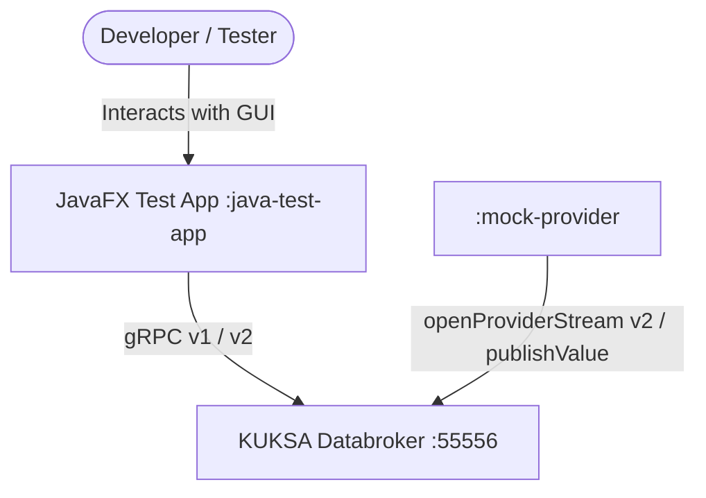

# Architecture: Java Test App & Mock Provider

## 1. System Context & C4 Model

## 2. Module Topology
1. `:kuksa-java-sdk` - Core library providing `DataBrokerConnector`, `KuksaValV1Protocol`, `KuksaValV2Protocol`.
2. `:vss-core` - Base models and extensions for VSS data model.
3. `:mock-provider` - Standalone JVM application providing behavior rules engine and actuation response mocking.
4. `:java-test-app` - JavaFX desktop application with Clean ViewModel / Controller separation.
5. `mock-environment` - Docker compose file and default behavior-rules YAML.

## 3. Technology Stack Decisions
- **UI Framework:** JavaFX 21 LTS (`org.openjfx.javafxplugin:0.1.0`).
- **Transport:** Netty shaded gRPC (`io.grpc:grpc-netty-shaded:1.65.1`).
- **Concurrency:** Kotlin Coroutines (`kotlinx-coroutines-core:1.8.1` + `kotlinx-coroutines-javafx:1.8.1`).
- **Model Generation:** `org.eclipse.velocitas.vss-processor-plugin:0.1.2` (KSP) from `vss/vss_rel_4.1.yaml`.
- **Config Serialization:** `com.charleskorn.kaml:kaml:0.61.0`.
